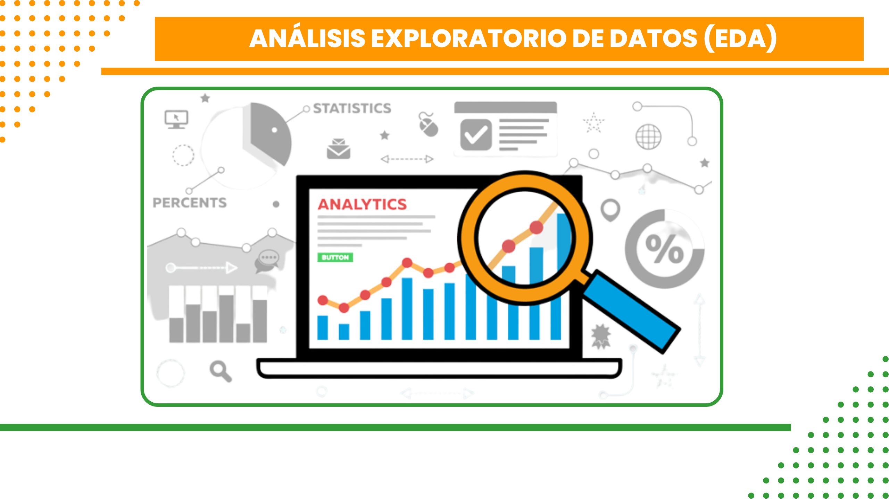
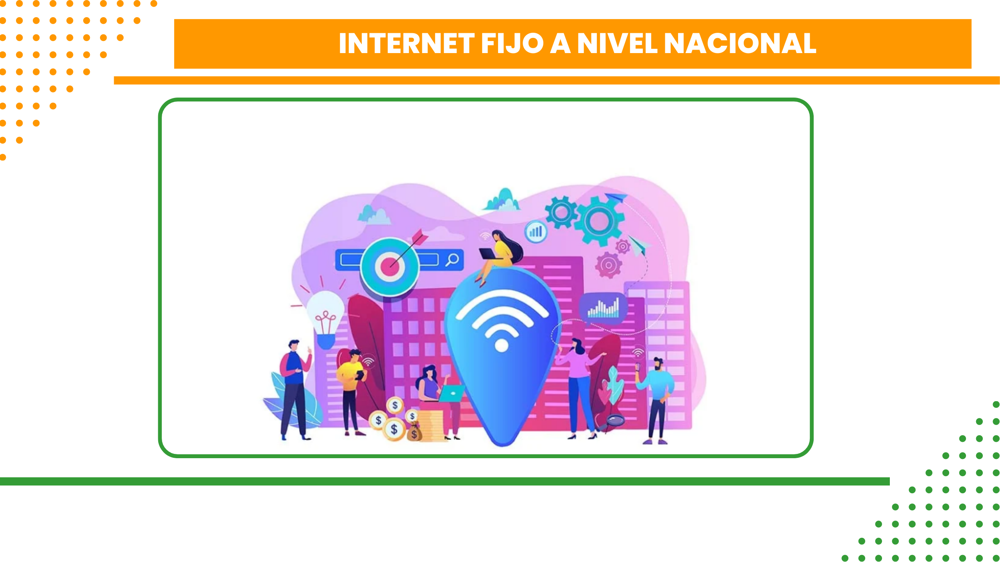
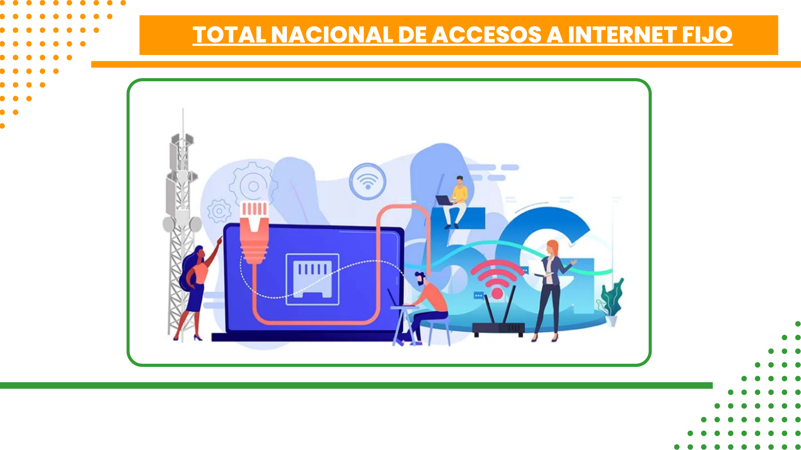
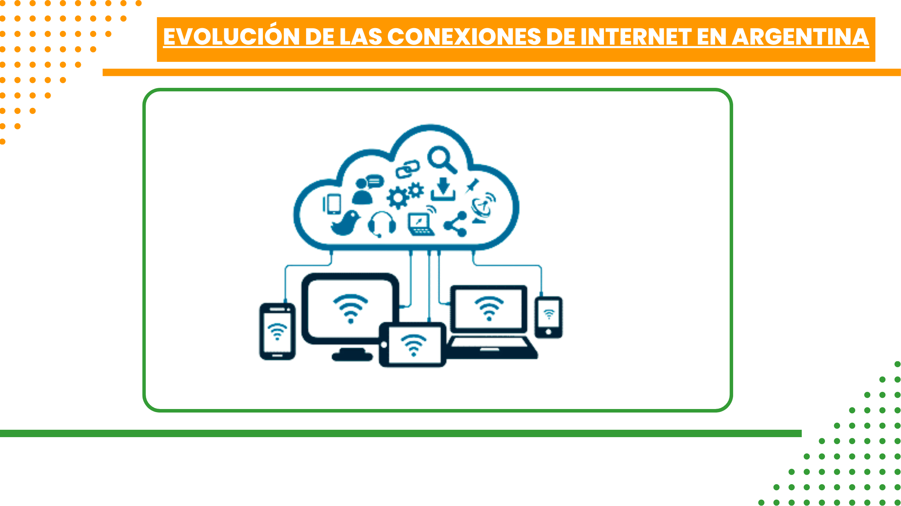
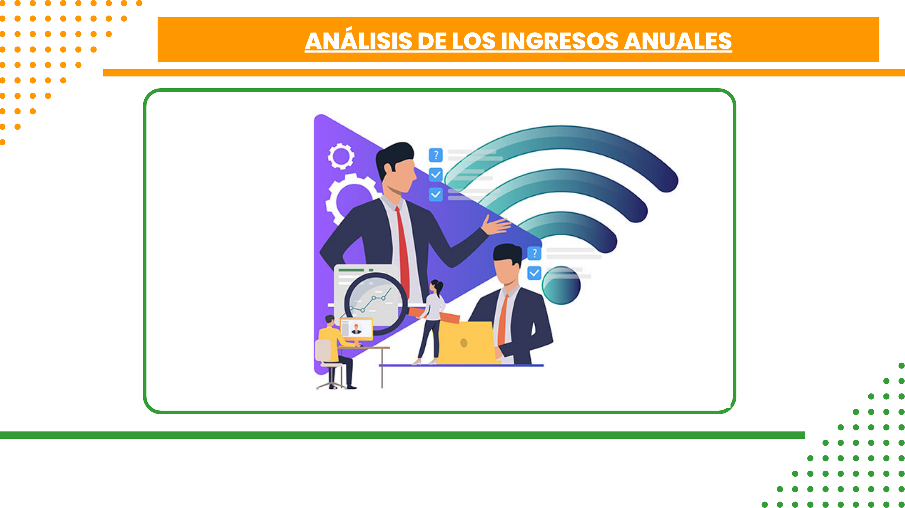
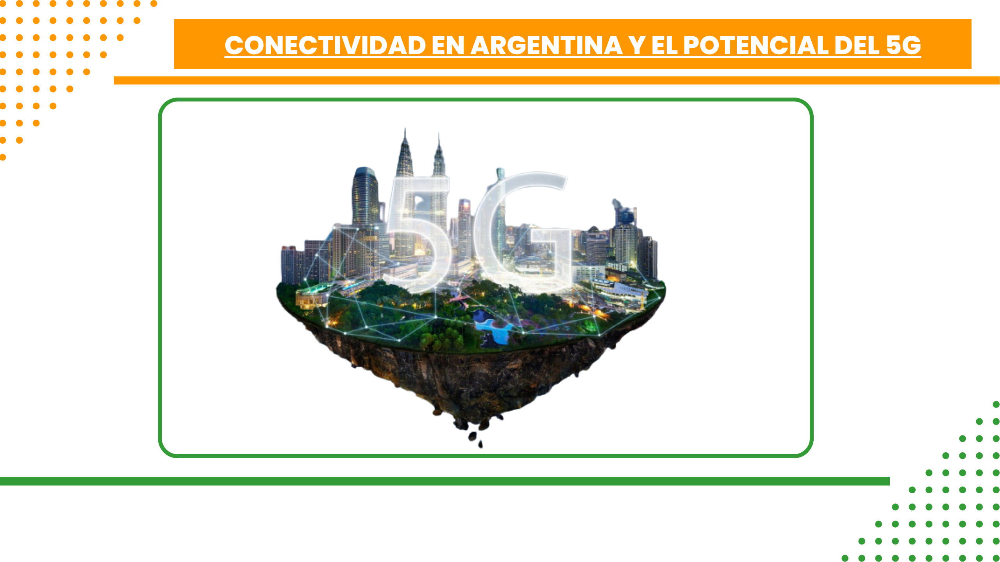

# <h1 align=center> **ANÁLISIS EXPLORATORIO DE DATOS-TELECOMUNICACION EN ARGENTINA** </h1>
# <h1 align=center> **PROYECTO INDIVIDUAL Nº2** </h1>

# <h1 align=center>**`Análisis Exploratorio de Datos (EDA)`**</h1>

  

## ¡Bienvenidos a nuestro proyecto de Análisis Exploratorio de Datos (EDA) sobre las telecomunicaciones en Argentina! En este estudio, hemos investigado la adopción de Internet fijo a nivel nacional, explorando diversos aspectos para obtener una visión completa de la situación. 📊🌐 

  

## **Descripción del proyecto**

¡Bienvenidos a nuestro proyecto de Análisis Exploratorio de Datos (EDA) sobre las telecomunicaciones en Argentina! En este estudio, hemos investigado la adopción de Internet fijo a nivel nacional, explorando diversos aspectos para obtener una visión completa de la situación. 📊🌐

**En este repositorio encontrarás un proceso integral de Análisis Exploratorio  que incluye:**

🌟 Aspectos destacados

+ Un completo cuaderno de Jupyter para una visualización fluida 
+ Un proceso EDA paso a paso 
+ Análisis exploratorio de datos y generación de ideas 
+ Dashboard 
+ Dataset 

📚 Contenido
 

# <h1 align=center> **Desarrollo del trabajo 👷** </h1> 
<h2 align=center> Nuestro EDA se ha centrado en 6 puntos clave que nos permiten comprender mejor la adopción de Internet fijo en el país:** </h2> 
 

  

## `Internet fijo a nivel nacional` 
1. Hemos analizado el alcance de `Internet fijo por cada 100 hogares` a lo largo del tiempo, utilizando `gráficos de línea` y un mapa de calor para visualizar las tendencias y variaciones en diferentes regiones. Esto nos ayuda a identificar patrones y tomar decisiones informadas sobre políticas públicas y desarrollo de infraestructura. 🌍

 

  

## `Total nacional de accesos a Internet fijo` 

2. Hemos examinado la `evolución de las suscripciones de banda ancha fija y dial-up` a lo largo de los años, destacando la preferencia de los usuarios por la banda ancha fija. Esto es útil para comprender la demanda de servicios de Internet y mejorar la calidad de las conexiones. 💻

 

  

## `Evolución de las conexiones de Internet en Argentina`
3. Hemos analizado la `evolución de las conexiones de Internet fijo en el país`, centrándonos en tipos como `ADSL, cablemódem, fibra óptica, wireless, entre otros`. Esto nos permite identificar las tecnologías más utilizadas y comprender las tendencias en el uso de Internet en Argentina. 📡

 

  

## `Distribución de accesos a Internet fijo por velocidad en provincias `  

4. Hemos examinado la distribución de los `accesos a Internet fijo en diferentes provincias` según la velocidad de bajada. Esto es útil para identificar las provincias con mayor consumo de velocidad y permitir a los proveedores adaptar sus ofertas y mejorar la calidad del servicio. ⚡️

 

  

## `Análisis de los ingresos anuales`  

5. Hemos explorado los `ingresos anuales y destacado el año 2022` como el de mayor ingreso. Esto nos brinda una visión general de la evolución de los ingresos y nos ayuda a tomar decisiones empresariales informadas. 💰

 

  

## `Conectividad en Argentina y el potencial del 5G`  

6. Hemos analizado las conexiones más comunes en Argentina, como `ADSL, cablemódem, fibra óptica, 4G`, entre otras, y hemos explorado el potencial del `5G`. Destacamos la `fibra óptica` como una de las conexiones más avanzadas, seguida de cerca por el `4G` y la conexión inalámbrica. Discutimos las ventajas y desafíos del despliegue del `5G` en el país. 🌐

En resumen, nuestro proyecto de `EDA` sobre las `telecomunicaciones en Argentina` ofrece un análisis exhaustivo de la adopción de Internet fijo en el país. Hemos explorado `tendencias, comparaciones y patrones clave, brindando información relevante` para la toma de decisiones en políticas públicas y estrategias empresariales. ¡Descubre más detalles en nuestro análisis! 📊🌐

## Detalles adicionales del proyecto

Aquí encontrarás información adicional y recursos relacionados con nuestro proyecto:

1. `Dashboard:` Hemos creado un [Dashboard](linck)  Te invitamos a verlo para comprender mejor cómo funciona nuestro `Analisis exploratorio de datos-telecomunicacion en Argentina.`

4. `Acceso rápido:`
- Visualize ETL [EDA.ipynb](.EDA.ipynb) notebook.

 

No dudes en explorar estos recursos para obtener una visión más completa y detallada de mi proyecto de `ANÁLISIS EXPLORATORIO DE DATOS-TELECOMUNICACION EN ARGENTINA.` Si tienes alguna pregunta o necesitas más información, no dudes en contactarnos [Douglas Sanchez](https://github.com/Sanchezdouglas) Disfruta del proyecto!

# <h1 align=center> **Mas detalles de telecomunicación 👷** </h1>

## `Beneficios de la telefonía:`  
`Conectividad global:` La telefonía permite a las personas estar conectadas en todo momento, sin importar su ubicación geográfica. Facilita la comunicación entre individuos, empresas e instituciones, promoviendo el intercambio de información y el acceso a servicios en cualquier lugar.

`Acceso a la información:` Gracias a la telefonía, podemos acceder rápidamente a una amplia gama de información. Podemos realizar búsquedas en Internet, acceder a servicios en línea, obtener noticias actualizadas y estar al tanto de los acontecimientos mundiales.

`Comunicación instantánea:` La telefonía permite una comunicación rápida y directa a través de llamadas telefónicas, mensajes de texto y aplicaciones de mensajería instantánea. Esto facilita la coordinación de actividades, la resolución de problemas y el intercambio de ideas en tiempo real.

`Desarrollo económico:` Las telecomunicaciones juegan un papel fundamental en el desarrollo económico de un país. Facilitan el comercio electrónico, el trabajo remoto, la colaboración empresarial y la expansión de los mercados. Además, fomentan la innovación y la creación de empleo en el sector de las telecomunicaciones.

## `Consideraciones y puntos en contra:`  
`Brecha digital:` Aunque las telecomunicaciones han avanzado significativamente, todavía existen disparidades en el acceso a servicios de telefonía, especialmente en áreas rurales y comunidades desfavorecidas. Esto crea una brecha digital, limitando el acceso a la información y oportunidades para algunas personas.

`Dependencia tecnológica:` La sociedad actual depende en gran medida de las telecomunicaciones, lo que puede generar una dependencia excesiva de la tecnología. La falta de acceso o interrupciones en los servicios pueden afectar negativamente la comunicación, el trabajo y la vida diaria de las personas.

`Problemas de privacidad y seguridad:` El uso de las telecomunicaciones implica la transmisión y almacenamiento de datos personales. Esto plantea preocupaciones sobre la privacidad y la seguridad de la información, especialmente en un mundo cada vez más conectado y expuesto a amenazas cibernéticas.

`Impacto ambiental:` La infraestructura necesaria para las telecomunicaciones, como antenas y centros de datos, consume energía y puede generar emisiones de carbono. Además, la fabricación y disposición de dispositivos electrónicos pueden tener un impacto negativo en el medio ambiente.

## `Importancia de las telecomunicaciones en la sociedad:`  
Si la sociedad no tuviera acceso a las telecomunicaciones, enfrentaríamos una serie de desafíos significativos:

`Aislamiento social:` La falta de telecomunicaciones limitaría nuestra capacidad para conectarnos con otros y mantener relaciones sociales, lo que podría llevar al aislamiento y la pérdida de oportunidades de colaboración y crecimiento.

`Dificultades en la educación:` Las telecomunicaciones desempeñan un papel fundamental en la educación actual, permitiendo el acceso a recursos educativos en línea, la participación en cursos en línea y la comunicación con profesores y compañeros. Sin estas herramientas, la educación se vería afectada.

`Impacto en el comercio y la economía:` Las telecomunicaciones son esenciales para el comercio electrónico, las transacciones financieras y la colaboración empresarial. La falta de acceso a estos servicios limitaría el crecimiento económico y la capacidad de las empresas para competir en un mercado globalizado.

En conclusión, nuestro análisis exploratorio de datos sobre las telecomunicaciones resalta los beneficios y consideraciones clave relacionados con la telefonía. Las telecomunicaciones brindan conectividad global, acceso a la información, comunicación instantánea y contribuyen al desarrollo económico. Sin embargo, también existen consideraciones importantes, como la brecha digital, la dependencia tecnológica, la privacidad y seguridad, y el impacto ambiental. Es crucial comprender y abordar estos aspectos para garantizar el acceso equitativo y sostenible a las telecomunicaciones en beneficio de toda la sociedad. 🌐📱

